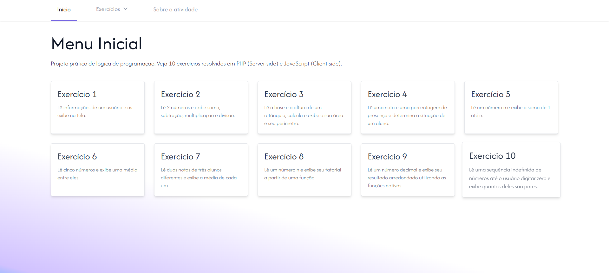

# Desenvolvimento Web II 💻

## 📋 Lista de Exercícios com JavaScript e PHP
> Esta seção do repositório contém uma série de **10 exercícios práticos** focados na consolidação de **lógica de programação**, com a implementação das soluções de forma comparativa em **Back-end (PHP)** e **Front-end (JavaScript)**.

### 🎯 Objetivos e Foco do Projeto
* **Paridade de Linguagem:** Resolver o mesmo desafio de lógica usando a sintaxe e as funcionalidades nativas tanto de PHP quanto de JavaScript, permitindo a comparação direta entre as abordagens Server-side e Client-side.
* **Estruturas Fundamentais:** Aplicação prática de condicionais, laços de repetição, funções, e manipulação de estruturas de dados essenciais (como vetores e matrizes).

### 🗝️ Conceitos Chave

* Cálculo de média e soma de progressão (lógica iterativa).
* Avaliação de critérios complexos (múltiplas condições de aprovação).
* Criação de funções matemáticas (ex.: fatorial, ceil, floor).
* Leitura de dados controlada por condição de parada (while/do-while simulado).

### 📸 Capturas de Tela
**Menu Inicial**

**Exercício 05**

